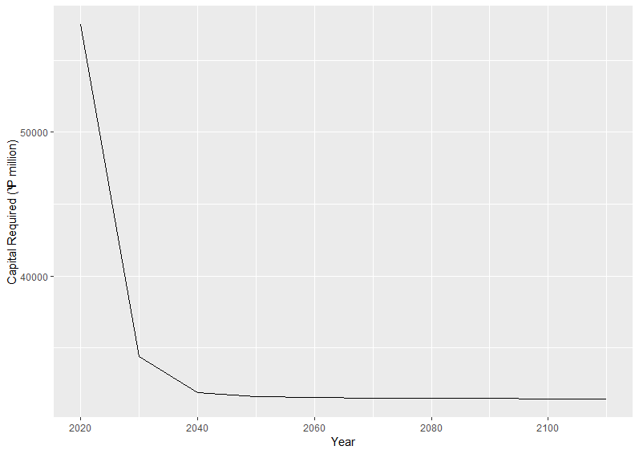

# 2023 Student Research Case Study Challenge: Relocation Social Insurance 

>
source: https://cdn.dribbble.com/users/330915/screenshots/3882301/media/d930615ad8352da62c7ae89fb800525f.gif

## UNSW x SOA sponsored by Valani Global

## Group JKB Consulting Report

The purpose of this page is to outline the key insights and analysis of the proposed scheme to address displacement risk as a result of climate impacts for Storlysia. For access to the full report and relevant codes, please click on the buttons below.

---

### Page Navigation

[Executive Summary](https://github.com/Actuarial-Control-Cycle-Part-A-2023-T1/Group-JKB/blob/main/README.md#executive-summary)

[Objectives](https://github.com/Actuarial-Control-Cycle-Part-A-2023-T1/Group-JKB/blob/main/README.md#objectives)

[Program Design](https://github.com/Actuarial-Control-Cycle-Part-A-2023-T1/Group-JKB/blob/main/README.md#program-design)

[Pricing and Costs](https://github.com/Actuarial-Control-Cycle-Part-A-2023-T1/Group-JKB/blob/main/README.md#pricing-and-costs)

[Assumptions](https://github.com/Actuarial-Control-Cycle-Part-A-2023-T1/Group-JKB/blob/main/README.md#assumptions)

[Risk and Risk Mitigation Strategies](https://github.com/Actuarial-Control-Cycle-Part-A-2023-T1/Group-JKB/blob/main/README.md#risk-and-risk-mitigation-strategies)

[Data and Data Limitations](https://github.com/Actuarial-Control-Cycle-Part-A-2023-T1/Group-JKB/blob/main/README.md#data-and-data-limitations)

[Conclusion/Recommendations](https://github.com/Actuarial-Control-Cycle-Part-A-2023-T1/Group-JKB/blob/main/README.md#conclusionrecommendations)

[References](https://github.com/Actuarial-Control-Cycle-Part-A-2023-T1/Group-JKB/blob/main/README.md#references)

---

## Executive Summary

This report was composed to design and evaluate a social insurance program to assist Storslysia in mitigating displacement risk as a result of climate-related hazard events. The program design specifies claim coverage of 30% of household goods and 12 months of temporary housing, as well as incentives such as buybacks and grants to provide opportunities for voluntary relocation to lower risk regions. Projections of economic costs over short- and long-term time frames with and without the proposed insurance program found that the scheme was able to reduce displacement costs with a high degree of certainty in the long-term under all climate scenarios. The economic capital needed would be at least φ 300 billion each year to remain solvent, but the scheme remains within 10% of GDP with 97.5% confidence. Moreover, the key risks were assessed through both qualitative and quantitative risk analyses, with suggested mitigation strategies. The report concludes with a recommendation of how to proceed with the implementation of the program based on the analyses performed. 

## Objectives

The goal of this social insurance program is to manage the financial risks associated with catastrophe-related displacement in Storslysia. To this end, the program aims to encourage proactive relocation which lowers damage risk and comes at a lower cost than involuntary displacement. This scheme will cover the entire population of Storslysia. As well as reducing long-term costs from climate-related disasters regardless of future emissions scenarios, this scheme will provide financial support to Storslysia citizens affected by such disasters. This program will be equitable in its design such that very affluent households are not advantaged by the scheme any more than lower or middle-class households. Keeping the costs arising from relocation from exceeding 10% of GDP each year with a high degree of certainty is the aim of this program. 

The following key metrics will be used to monitor the social insurance program:

| Metric                                               | Frequency                                             |
| ---------------------------------------------------- | ---------------------------------------------------- |
| Compare costs with and without the scheme            | Annually for the first 10 years, then every 3 years |
| Number of people who voluntarily relocated each year | Annually                                             |
| Cost as a percentage of GDP                          | Annually                                             |
| Value at risk                                        | Annually                                             |

## Program Design
In our program, all citizens of Storslysia will be covered for displacement costs after a climate catastrophe. However, we will distinguish between support for households who are voluntarily relocating and households who are involuntary relocating due to a natural disaster. We also distinguish between renters and owner-occupiers. 

### Requirements to make a claim
All households, regardless of region, are entitled to financial support for temporary housing, rebuilding their property and household-goods replacement costs. For households in regions 2, 4, 5 and 6, additional support is provided contingent upon that household relocating to regions 1 or 3, the lower risk regions. (See report Appendix Table 2.1 for justification of which regions are high and low risk).
To be eligible for voluntary relocation support, a household in a highly affected region (regions 2, 4, 5 and 6) may apply for financial assistance to relocate their household to a safer region (regions 1 or 3). Both renters and owner-occupiers in highly affected regions are eligible for this support. 
To be eligible for involuntary relocation support, a household in regions 2, 4, 5 or 6 must be affected by a severe weather event, causing irrecoverable damage to the home such that it is no longer fit for living. 

>
source: https://guillaumekurkdjian.com/wp-content/uploads/2017/06/C_house_dribbble.gif

### Program coverage
Support for all households with uninhabitable homes affected by the natural disaster, regardless of the region, include the following:

* Up to 30% of housing costs will be paid out to replace household goods.
* Up to 30% of the median value of houses in that region.
* Temporary housing in the affected region is provided for 12 months.
  
In addition, the following benefits are included as a part of the program to assist with relocation:

|                                  | Voluntary relocation                                                            | Involuntary relocation                                                                              | 
| -------------------------------- | ------------------------------------------------------------------------------- | --------------------------------------------------------------------------------------------------- |
| Owner-occupiers (Region 2,4,5,6) | Pay for construction of new home (up to median value) + lump-sum of φ 10,000 | Buy back uninhabitable homes (up to median value) provided the household moves to a low-risk region |
| Renters (Region 2,4,5,6)         | Pay for home rental costs for 6 months (up to median rent)                      | Pay for home rental costs for 2 months in the new region (up to the median rent)               |

>
source: https://cdn.dribbble.com/users/330915/screenshots/6554409/1_new_condo.gif

## Pricing and Costs

### Methodology
To accurately project the economic costs of the climate-related catastrophes for Storslysia, data was gathered from Storslysia’s quarterly historical record of climate-related catastrophes ranging from 1960 to 2020, as well as economic and demographic data on each of the 6 regions. Exploratory data analysis was performed to understand the economic and demographic nature of each region and their climate risks. A training set of data was selected for the period 1960 to 2015, leaving the last 5 years as a validation set to assess performance via various metrics. Taking a frequency-severity approach to pricing claims cost, forecasts were projected for each region using simulations from each distribution, before aggregating to a final estimate with 97.5% confidence intervals.

### Short-term projections - average over the program's first 10 years

#### Economic costs
Without the proposed insurance program, the cost of total property damage is estimated to be close to φ 255 million per annum. Along with property damage, climate-related catastrophes also come with additional costs, including temporary housing for involuntary relocation, material and labour for rebuilding damaged properties, and replacing household items. These costs have been summarised in the table below as displacement costs. The short-term projection (2020-2030) for total economic cost is φ 836.6 million per annum. 

|                      | Mean Estimates | Upper Bound (97.5%) |
| -------------------- | -------------: | ------------------: |
| Property Damage      | φ 255,115,548   | φ 9,637,762,244     |
| Displacement Costs   | φ 581,450,888  | φ 25,738,567,833    |
| Total Economic Costs | φ 836,566,436  | φ 35,376,330,076    |

#### Program costs
Under the proposed social insurance program, residents in high-risk areas (Region 2, 4, 5, 6) will be incentivised to move both before and after a hazard event occurs. This corresponds to the voluntary and involuntary costs below, respectively. In the short-term, this program will lead to higher economic costs due to extra payments to incentivise residents to move to lower-risk regions through lump-sum payments, construction of new homes, rent payments and house buy-backs (see Program Design section for full details).

From the projected values below, a slight reduction in the mean property damage and displacement cost estimates is evident, compared to costs without the program (11.6% and 6.9% respectively). Additionally, in the short-term (2020-2030), the cost of incentivising voluntary relocation is around φ 12 billion, while involuntary relocation after a hazard event is only around φ 55.5 million. As the number of voluntary relocations declines, the scheme costs will also decline.

|                            | Mean Estimates   | Upper Bound (97.5%) |
| -------------------------- | ---------------: | ------------------: |
| Property Damage            | φ 225,302,571    | φ 8,968,316,447     |
| Displacement Costs         | φ 514,378,676    | φ 23,953,318,562    |
| Relocation Incentive Costs | φ 12,310,238,772 | φ 12,310,238,772    |
| *Voluntary Costs*          | φ 12,254,805,736 | φ 12,254,805,736    |
| *Involuntary Costs*        | φ 55,433,035     | φ 55,433,035        |
| Total Economic Costs       | φ 13,049,920,018 | φ 45,231,873,780    |

### Long-term projections

#### Program costs
With the social insurance program in place, the effects of incentivising relocation will continue to be experienced and reduce the overall property damage and displacement costs. Averaging over 10 years of economic costs (i.e. 2070-2080), gives the values in the table below. Both the mean and upper bound estimates for property damange and displacement costs are significantly lower than without the program (12.6% and 10.9% respectively). Moreover, the incentive cost for voluntary relocation is under φ 200,000, suggesting that the equilibrium population allocation in each region has almost been reached. The average displacement costs have also decreased another 8% from the initial short-term projection.

|                            | Mean Estimates   | Upper Bound (97.5%) |
| -------------------------- | ---------------: | ------------------: |
| Property Damage            | φ 206,962,717    | φ 8,570,367,393     |
| Displacement Costs         | φ 473,142,809    | φ 22,892,334,372    |
| Relocation Incentive Costs | φ 51,065,396     | φ 51,065,396        |
| *Voluntary Costs*          | φ 174,906        | φ 174,906           |
| *Involuntary Costs*        | φ 50,890,490     | φ 50,890,490        |
| Total Economic Costs       | φ 731,170,922    | φ 31,513,768,160    |

### Capital and solvency requirements
According to the European Union’s Solvency II requirement, companies must hold enough capital to have a 99.5% confidence of surviving the most extreme expected losses during a year (Risk.net n.d.). To ensure this same level of certainty for Storslysia’s insurance program, the total economic capital in the first year of implementation would be close to φ 390 billion. After that, each subsequent year requires less capital to be held ending at around φ 346 billion needed in 2110. The amount of capital needed over the short and long-term timeframes is displayed in the graph below.

## Assumptions
Assumptions within the modelling process, economic climate and validity of the utilised datasets were required to ensure the program generated accurate and reliable results. A summary of all the assumptions used can be seen in the table below.

| # | Assumption | Explanation |
| --- | :--- | :--- |
| 01 | Population | Closed population model (based on 2021 population) |
| 02 | Voluntary relocation | 4% of households voluntarily relocate each year, decreasing by 20% per year |
| 03 | Displacement | 20% of households impacted by climate event will relocate | 
| 04 | Temporary housing | Only needed for 12 months after a hazard event which is adequate time to rebuild a house to a liveable state |
| 05 | Inflation | Average material and labour inflation after a hazard event is 25%, while in the more severe scenarios is 50%; no inflation for voluntary relocation |
| 06 | House contents | Value as proportion of house value is based on ABS data, average cost of replacing increases by 57.5% after a hazard event, with the more severe case of 75% |
| 07 | Median value | Property values of each region are estimated by median value |
| 08 | Property damage | Increases/decreases are proportional to the changes in population in the region |
| 09 | Model | Chosen frequency and severity models are correct |
| 10 | Interpolation | Data can be accurately interpolated via linear or geometric mean |

## Risk and Risk Mitigation Strategies

### Key risks and mitigation strategies
When a project is underway, unexpected factors have the potential to affect the success of a project, and thus proactive identification, assessment and action improves the chance of success in meeting project objectives (Hillson, David 2014). The risk matrix (below) illustrates the key areas of risk present within the scheme, and is accompanied by an explanatory table:

 

Risk | Description | Mitigation
--- | --- | ---
A: Event Risk | Risk that future climate events result in damages deviating from model predictions; regions may not be homogeneously affected by climate change and new homes in regions 1 and 3 may have different risk profiles from existing homes | Monitor model predictions versus actual property damage on a regular basis; perform sensitivity analysis at the 97.5% event-risk level and hold recommended capital reserves at the 99.5% risk-level |
B: Legislative/ Governance Risk | Frequency and severity of climate events are contingent upon governments' climate policies; political and governance changes may require modifications to the scheme | Close analysis and discussion with Storslyia's government annually to determine if the scheme is still adequate; consider impact different climate scenarios |
C: Inequality Risk | Risk that the scheme exacerbates or creates inequalities by disproportionately assisting citizens of higher socio-economic status who are often owner-occupiers | Specific schemes to assist lower-income and wealth individuals and limit the maximum amount paid (such as paying up to the median value of properties in the new region); monitoring people who take up the scheme and modifying it to make it more equitable |
D: Migration Risk | Program's ability to induce relocations from one region to another is constrained by household decision making, affecting the economic success of the scheme | Financial compensation provided to incentivise relocations, which will be reviewed and updated |
E: Prediction Risk | Difficulty in projecting for long-term timeframes of up to 100 years, resulting in volatile forecasts and affecting capital allocation and scheme costing | Conservative approach taken in claims modelling and in assumptions; sensitivity analysis performed to consider impact of varying scenarios

### Sensitivity analysis
The sensitivity analysis is performed using the Shared Socioeconomic Pathways (SSPs) carbon emissions scenario forecasts (see Appendix Table 3.2). The projected log values of the long-term economic costs without the program are shown in the graph below. Under the best scenario (SSP1) where the world shifts to become greener and more sustainable, then the costs of climate-related disasters can be reduced below current (2020) levels. However, in the other 3 scenarios of higher carbon emissions, the economic cost will only continue to increase in the future. In the most severe scenario (SSP5), the average economic cost could increase up to 17-fold by 2150.

### Certainty of cost estimates
Under the proposed program, there is a 97.5% confidence that costs will not exceed 10% of Storslysia’s GDP in any given year as seen in the graph below. The solid lines represent the scheme cost and dashed lines represent 10% of GDP, each under the four SSP scenarios. The real GDP is modelled assuming no population growth and only increases in GDP per capita. While the scheme does not exceed 10% of GDP between now and 2100, there is the possibility it may exceed this level after 2100, particularly in the SSP5 scenario. This means that the program and underlying model assumptions must be assessed in the future to ensure it remains sustainable beyond around 80 years.
>

Given constant claims (no adjusting for climate scenarios), the scheme is expected to have a negative economic benefit for 26 years. After this, the scheme delivers benefits increasing to $110 million in reduced damage and displacement costs per year. Under higher claims scenarios, the economic benefits of the scheme increase: 
  
* Under the SSP2 scenario and the mean claims predicted, the scheme delivers positive economic benefits within 20 years reaching $180 million per year by 2065  
* Under the severe claims (97.5th percentile) and SSP3 scenario, the scheme delivers economic benefits within 10 years, which can reach almost $10 billion per year (see report Appendix Table 6.1 and 6.2)
  
The success of the scheme depends on the take-up of the voluntary relocation program, the main driver of reduced risks and reduced damage and associated costs. Secondary research suggested that between 15-20% of people would consider relocating to be away from high-risk areas without any additional financial incentive; hence, our 20% estimate of voluntary relocation is rather conservative, and take-up may be even higher (Yazzie R. 2021). 

## Data and Data Limitations

### Data Sources
In addition to the Storlysia-specific data – housing and demographic information, historical weather-related hazards data and macroeconomic data – external data from the ABS (Australiabn Bureau of Statistics) was also utilized to inform the modelling process.

### Limitations of provided data
There are inherent data limitations which inhibit the predictive capacity of the program and hence reliability. Operational risks as a result of human error when inputting, duplicate or missing values and one-off extreme values in historical data (e.g. inflation values in 2003) have impacts in the training of the model. To overcome these limitations, interpolation via linear or geometric means using surrounding data was utilised where appropriate. The rationale for this was due to calibrate the model without the influence of severe outliers.

### Limitations when utilising data
The inability of historical data to perfectly capture population movements and account for unique situations within the future also presents a limitation in the modelling process, thereby limiting the accuracy of our program analysis. This is especially prevalent within the climate modelling area which has seen impacts in frequency and severity exacerbated by climate change. Compilation of data and the period of impacts has also presented a limitation as hazard event data only accounts for property damage (and does not distinguish between household goods, and material and labour costs) which is recognized and measured in days (duration). More precise calculations of property damage as well as duration of the hazard event would thus increase the predictive capacity of the models, as well as more data points to train the frequency and severity models. 

## Conclusion/Recommendations
In conclusion, the proposed social insurance scheme can help Storslysia mitigate their climate-related displacement risk while remaining under 10% GDP with a high level of confidence. After extensive analysis on the impact of the social insurance program over short and long-term timeframes and under different climate scenarios, the improved financial and social benefits associated with the scheme provide substantial evidence that the project should be undertaken given our assumptions. Although there are risk mitigation analysis and monitoring protocols incorporated within the program design of the scheme, it is quintessential to verify the plausibility of assumptions to ensure the validity and success of the scheme in achieving its objective to manage the financial risks associated with catastrophe-related displacement in Storslysia. The viability and strategy of financing the scheme must also be considered. 

## References
  
* Australian Bureau of Statistics, 4102.0 -  Australian Social Trends, Dec 2011, Commonwealth of Australia, last accessed 21st March 2023, < https://www.abs.gov.au/AUSSTATS/abs@.nsf/Lookup/4102.0Main+Features10Dec+2011>
* C, S. (2017) Social Insurance: Meaning and Features, last accessed 18th March 2023,  <https://www.economicsdiscussion.net/social-insurance/social-insurance-meaning-and-features-poverty-economics/29305>
* College of Vocational Studies, Meaning of Social Insurance Features of Social Insurance, Last accessed 21st March 2023, < https://www.cvs.edu.in/upload/Social%20insurance%20-%20feature%20and%20need.pdf>
* Department of Regional NSW, Northern Rivers Reconstruction Corporation (2022) Northern Rivers’ voluntary home buy backs to start, last accessed 19th March 2023 <https://www.nsw.gov.au/media-releases/northern-rivers-voluntary-home-buy-backs-to-start>
* Deryugina, T. (2022), Economic effects of natural disasters, IZA World of Labor, last accessed 22nd March 2023, <IZA World of Labor - Economic effects of natural disasters >
* Greer, A., Trainor, J. and McNeil, S. (2019) “Voluntary Household Relocation Decision Making in the Wake of Disaster: Re-interpreting the Empirical Record,” International Journal of Mass Emergencies and Disasters, 37(2), pp. 197–226, last accessed 18th March 2023, <https://doi.org/10.1177/028072701903700206>
* King D., Bird D., Haynes K., Boon, H., Cottrell A., Millar J., Okada T., Box P., Keogh D., Thomas M. 2014, Voluntary Relocation as an adaption strategy to extreme weather events, International Journal of Disaster Reduction, last accessed 20th March 2023, < https://www.csu.edu.au/__data/assets/pdf_file/0009/1801764/Voluntary-relocation-King-et-al.pdf>
* OECD (2019), Monitoring and Evaluating social protection systems, last accessed 21st March 2023, <https://www.oecd.org/dev/inclusive-societies-development/Lessons_learned_M-E.pdf>
* Our World in Data., Data Explorer: IPCC Scenarios, last accessed 23rd March 2023, <Data Explorer: IPCC Scenarios - Our World in Data > 
* Risk.net, Solvency Capital requirement (SCR), last accessed 23rd March 2023, <Solvency capital requirement (SCR) definition - Risk.net>
* Seong K., Losey C. (2020), To Remain or Relocate? Mobility Decisions of Homeowners Exposed to Recurrent Hurricanes, last accessed 20th March 2023, <https://hazards.colorado.edu/quick-response-report/to-remain-or-relocate-mobility-decisions-of-homeowners-exposed-to-recurrent-hurricanes>
* Yazzie R. (2021), How Long Does It Take to Build a House: Is It Worth The Wait, Better Homes and Gardens Real Estate, last accessed 19th March 2023, < https://www.homecity.com/blog/how-long-does-it-take-to-build-a-house/#:~:text=The%20average%20new%20home%20building,home%2C%20and%20the%20final%20walkthrough>

